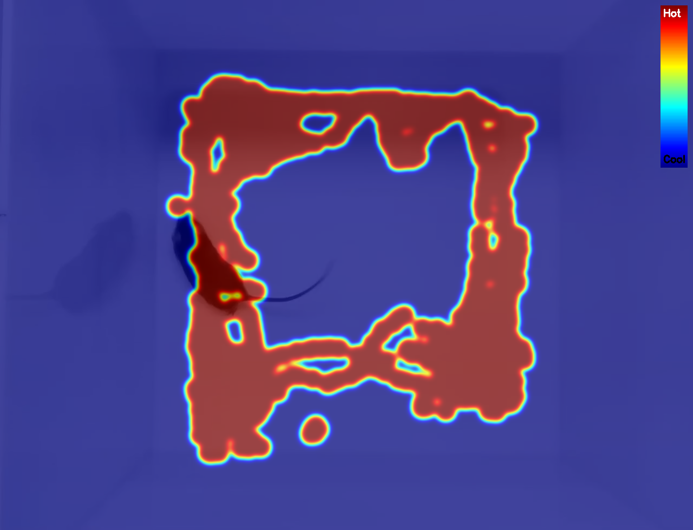
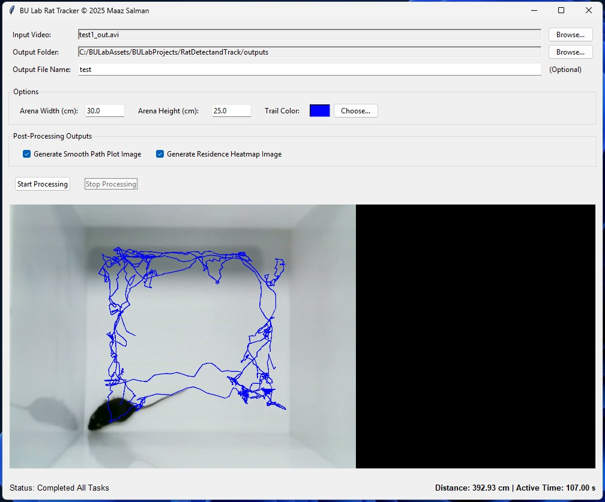

---

# 🐀 YOLOv8 Real-Time Rat Detection and Tracking

This project uses a custom-trained **YOLOv8** model to detect and track rats in video streams, compute the distance traveled, and generate visual analytics such as path plots and heatmaps.

---

<table>
  <tr>
    <td></td>
    <td></td>
    <td></td>
  </tr>
</table>

##  Application

<table>
  <tr>
    <td></td>
  </tr>
</table>

## ✨ Features

* 🎯 Custom object detection using YOLOv8
* 🧭 Real-time tracking with dynamic path drawing
* 📊 Post-processing: path plots and heatmaps from detection logs
* 📐 Real-world distance estimation

---

## ⚙️ Setup

### 1. Clone the Repository

```bash
git clone https://github.com/zamaex96/Animal-Tracking-YOLO.git
cd Animal-Tracking-YOLO
```

### 2. Install Git LFS and Pull the Model

```bash
git lfs install
git lfs pull
```

### 3. Create and Activate the Conda Environment

```bash
conda create --name yolo_rats python=3.9 -y
conda activate yolo_rats
```

### 4. Install Dependencies

```bash
pip install ultralytics opencv-python numpy scipy
```

---

## 🚀 Usage

### Run the Main Tracking Script

```bash
python scripts/track_and_plot_trail.py
```

### Generate Post-Processing Visualizations

#### Smooth Path Plot

```bash
python scripts/plot_smooth_path.py
```

#### Heatmap Generation

```bash
python scripts/heatmap.py
```

---

---
## 📥 Download the Application

**The latest version can be downloaded from the [GitHub Releases page](https://github.com/zamaex96/Animal-Tracking-YOLO/releases).**

[](https://github.com/zamaex96/Animal-Tracking-YOLO/releases/tag/v1.0.0)

---


